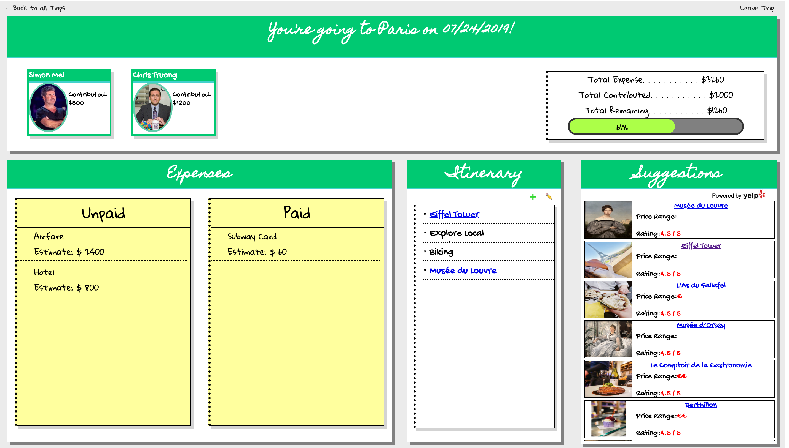
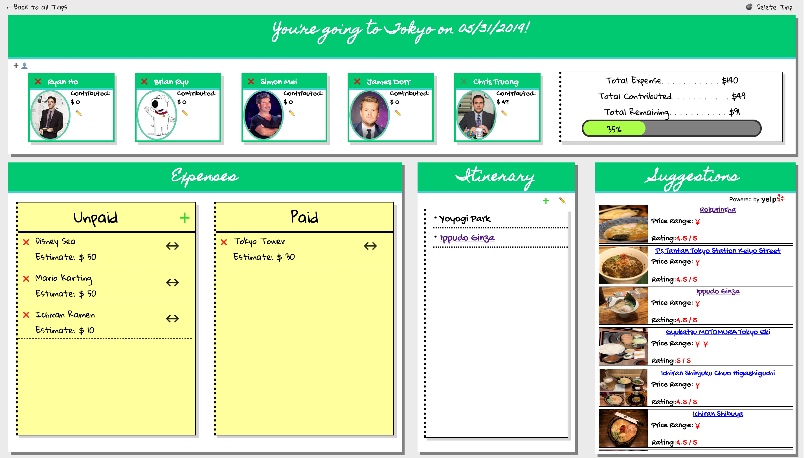

# Let's Go!
Let's Go! is a Group Trip Budgeting and Planning Application for friends who are want to plan and budget a trip together built using React.js + Redux with a Ruby on Rails [backend API](https://github.com/cStruong/letsgo_back).

## Introduction
Let's Go! is my Capstone Project inspired to solve a problem me and my friends had while planning a group trip. We originally used a spreadsheet to plan a trip but quickly found it to be difficult and tedious. I created Let's Go to be a platform where individuals can plan and budget a trip together.

## Table of Contents
1. [Technologies](#technologies)
2. [Setup](#setup)
3. [Site](#site)

## Technologies<a name="technologies"></a>
This project is created using: 
* React ([React.js](https://reactjs.org/))
* [Redux](https://redux.js.org/)
* [Yelp Fusion API v3](https://www.yelp.com/developers/documentation/v3)

## Setup / Startup (locally) <a name="setup"></a>
To run this project locally, while in the project directory run
```
npm install && npm start
```
*note: in order to persist any changes/creations the [backend](https://github.com/cStruong/letsgo_back) must be started as well.*

## Site <a name="site"></a>
### Landing Page


### User Page


### Trip Member(non-admin trip page) Page


### Trip Admin Page


## Acknowledgements
* Progress Bar in Trip Page inspaired by [Dan Zuzevich's Blog](https://medium.com/@ItsMeDannyZ/how-to-build-a-progress-bar-with-react-8c5e79731d1f)
